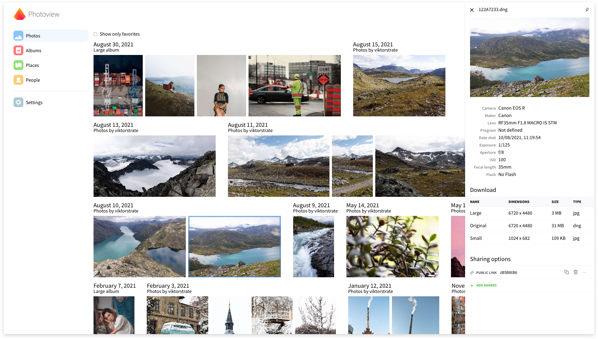
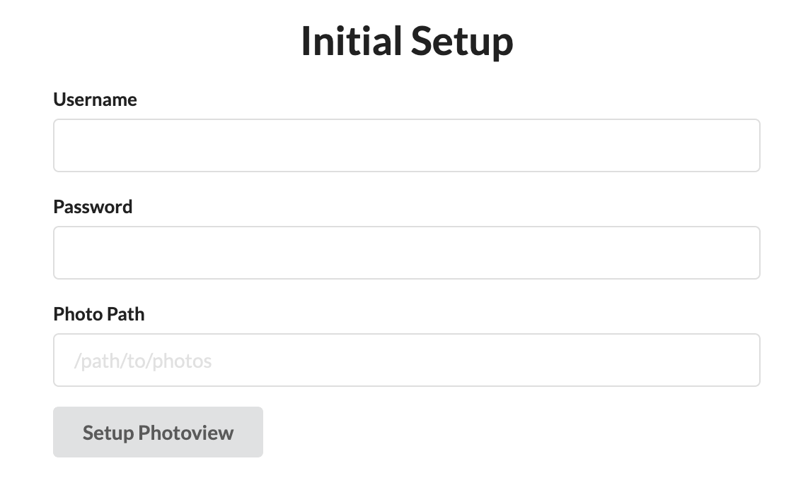

[](./LICENSE.txt)
[](https://github.com/viktorstrate/photoview/graphs/contributors)
[](https://hub.docker.com/r/viktorstrate/photoview)
[](https://github.com/photoview/photoview/actions/workflows/build.yml)
[](https://codecov.io/gh/photoview/photoview)



Photoview is a simple and user-friendly photo gallery that's made for photographers and aims to provide an easy and fast way to navigate directories, with thousands of high-resolution photos.

You configure Photoview to look for photos and videos within a directory on your file system. The scanner automatically picks up your media and starts to generate thumbnail images to make browsing super fast.

When your media has been scanned, they show up on the website, organised in the same way as on the filesystem.

> If you have questions regarding setup or development,
feel free to join the Discord server https://discord.gg/jQ392948u9

## Demo site

Visit https://photos.qpqp.dk/

Username: **demo**
Password: **demo**

## Contents

- [Demo site](#demo-site)
- [Main features](#main-features)
- [Supported Platforms](#supported-platforms)
- [Why yet another self-hosted photo gallery](#why-yet-another-self-hosted-photo-gallery)
- [Getting started — Setup with Docker](#getting-started--setup-with-docker)
- [Advanced setup](#advanced-setup)
- [Contributing](#contributing)
- [Set up development environment](#set-up-development-environment)
- [Sponsors](#sponsors)

## Main features

- **Closely tied to the file system**. The website presents the images found on the local filesystem of the server; directories are mapped to albums.
- **User management**. Each user is created along with a path on the local filesystem, photos within that path can be accessed by that user.
- **Sharing**. Albums, as well as individual media, can easily be shared with a public link, the link can optionally be password protected.
- **Made for photography**. Photoview is built with photographers in mind, and thus supports **RAW** file formats, and **EXIF** parsing.
- **Video support**. Many common video formats are supported. Videos will automatically be optimized for web.
- **Face recognition**. Faces will automatically be detected in photos, and photos of the same person will be grouped together.
- **Performant**. Thumbnails are automatically generated and photos first load when they are visible on the screen. In full screen, thumbnails are displayed until the high-resolution image has been fully loaded.
- **Secure**. All media resources are protected with a cookie-token, all passwords are properly hashed, and the API uses a strict [CORS policy](https://developer.mozilla.org/en-US/docs/Web/HTTP/CORS).

## Supported platforms

- [Docker](https://hub.docker.com/r/viktorstrate/photoview/)
- [Arch Linux Aur](https://aur.archlinux.org/packages/photoview)
- [Unraid](https://forums.unraid.net/topic/103028-support-photoview-corneliousjd-repo/)
- EmbassyOS: [announcement](https://start9labs.medium.com/new-service-photoview-72ee681b2ff0), [repo](https://github.com/Start9Labs/embassyos-photoview-wrapper)
- [YunoHost](https://github.com/YunoHost-Apps/photoview_ynh)

## Why yet another self-hosted photo gallery

There exists a lot of open-source self-hosted photo galleries already. Here are some, just to mention a few.

- [Piwigo](https://github.com/Piwigo/Piwigo)
- [LibrePhotos](https://github.com/LibrePhotos/librephotos)
- [Photoprism](https://github.com/photoprism/photoprism)
- [Lychee](https://github.com/LycheeOrg/Lychee)

So why another one?
I love taking photos, and I store all of them on my local fileserver.
This is great because I can organize my photos directly on the filesystem, so it's easy to move them or take backups. I want to be able to control where and how the photos are stored.

The problem is, however, that RAW images are extremely tedious to navigate from a fileserver, even over the local network.

My server holds a lot of old family pictures that I would like my family to have access to as well.
And some of the pictures I would like to easily be able to share with other people without the hassle of them having to make an account first.

Thus, I need a solution that can do the following:

- A scan-based approach that automatically organises my photos
- Support RAW and EXIF parsing
- Have support for multiple users and ways to share albums and photos also publicly
- Be straightforward and fast to use

All the photo galleries can do a lot of what I need, but no single one can do it all.

## Getting started — Setup with Docker

> This section describes how to get Photoview up and running on your server with Docker.
> Make sure you have Docker and docker-compose installed and running on your server.
> `make` should be installed as well if you'd like to use provided `Makefile`, which is optional (see step 4 for more details).
> `7zz` should be installed in case, you'd like to use it in scope of the backup scenario instead of the default .tar.xz format. Read the comment in the `Makefile`, located on top of the `backup` section for more details.

1. Download the content of the `docker-compose example` folder to the folder on your server, where you expect to host the Photoview internal data (database and cache files).
   
   Please note that this folder contains 2 versions of the docker-compose file:
   - `docker-compose.example.yml` - the fully-functional and recommended for the most cases config
   - `docker-compose.minimal.example.yml` - the minimal and simple config for those, who find the previous one too complex and difficult to understand and manage
   
   When downloading files, you need to choose only one of them.
2. Rename downloaded files and remove the `example` from their names (so, you need to have `.env`, `docker-compose.yml`, and `Makefile` files). If you choose the `docker-compose.minimal.example.yml` on previous step, make sure to rename it to the `docker-compose.yml`.
3. Open these files in a text editor and read them. Modify where needed according to the documentation comments to properly match your setup. There are comments of 2 types: those, starting with `##`, are explanations and examples, which should not be uncommented; those, starting with `#`, are optional or alternative configuration parts, which might be uncommented in certain circumstances, described in corresponding explanations. It is better to go through the files in the next order: `.env`, `docker-compose.yml`, and `Makefile`.
4. Make sure that your media library's root folder and all the files and subfolders are readable and searchable by other users: run the next command (or corresponding sequence of commands from the `Makefile`):

   ```bash
   make readable
   ```

   If command(s) return `Permission denied` error, run them under the user, owning corresponding files and folders. Alternatively, run them adding `sudo ` before the command: this will switch the execution context to `root` user and ask for the root password. You have to have permission to run `sudo` in the system.

   If you don't want to give required permissions to `others` group for your files, alternatively, you can:

   - create a group on your host with GID=999 and make all the files and folders inside volumes of the `photoview` service being owned by this group; then set the appropriate permissions to the `group` section.
   - create on your host a group with GID=999 and a user in this group with UID=999; then change the ownership of all the files and folders inside volumes of the `photoview` service to this user; then set the appropriate permissions to the `user` section.

   If you configured other mounts with media files from other locations on the host (like HOST_PHOTOVIEW_MEDIA_FAMILY or anything else), you need to run the same commands, as in the `Makefile` `readable` target, for each media root folder on your host manually: copy each command to your shell and replace the variable with the absolute path to an additional media root folder without the trailing `/`. Run both commands for each additional root folder.
5. In case, you don't have `make` installed in your system or don't want to use it for the Photoview management activities, you could use the same commands from the `Makefile` and run them in your shell directly, or create your own scripts. Make sure to apply or replace the variables from your `.env` first in this case. `Makefile` is provided just for your convenience and simplicity, but is optional.
6. Start the server by running the following command (or corresponding sequence of commands from the `Makefile`):

   ```bash
   make all
   ```

If the endpoint or the port hasn't been changed in the `docker-compose.yml` file, Photoview can now be accessed at http://localhost:8000

### Initial Setup

If everything is set up correctly, you should be presented with an initial setup wizard when accessing the website the first time.



Enter a new username and password.

For the photo path, enter the path inside the docker container where your photos are located.
This can be set from the `docker-compose.yml` file under `photoview` -> `volumes`.
The default location is `/photos`.

A new admin user will be created, with access to the photos located at the path provided under the initial setup.

The photos will have to be scanned before they show up, you can start a scan manually, by navigating to `Settings` and clicking on `Scan All`

## Advanced setup

We suggest securing the Photoview instance before exposing it outside your local network: even while it provides read-only access to your media gallery and has basic user authentication functionality, it is not enough to protect your private media from malicious actors on the Internet.

Possible ways of securing a self-hosted service might be (but not limited to):

1. Configure a **Firewall** on your local network's gateway and allow only the intended type of incoming traffic to pass.
2. Use **VPN** to provide external access to local services.
3. Setting up a **Reverse proxy** in front of the service and forwarding all the traffic through it, exposing HTTPS port with strong certificate and cipher suites to the Internet. This could be one of the next products or something else that you prefer:
   - [Traefic Proxy](https://doc.traefik.io/traefik/)
   - [NGinx Proxy Manager](https://nginxproxymanager.com/guide/)
   - [Cloudflare Gateway](https://www.cloudflare.com/zero-trust/products/gateway/)
4. Configure an external **Multi-Factor Authentication** service to manage authentication for your service (part of Cloudflare services, but you can choose anything else).
5. Configure **Web Application Firewall** to protect from common web exploits like SQL injection, cross-site scripting, and cross-site forgery requests (part of Cloudflare services, but you can choose anything else).
6. Use **Content Delivery Network** as an additional level of DDoS prevention: it can securely cache your media and let it be accessible from a wide list of servers on the Internet (part of Cloudflare services, but you can choose anything else).
7. Configure a **Rate Limit** of allowed number of requests from a user during specified time range to protect against DDoS attacks.
8. Set up an **Intrusion Detection/Prevention System** to monitor network traffic for suspicious activity and issue alerts when such activity is discovered.

Setting up and configuring of all these protections depends on and requires a lot of info about your local network and self-hosted services. Based on this info, the configuration flow and resulting services architecture might differ a lot between cases. That is why in the scope of this project, we can only provide you with this high-level list of possible ways of webservice protection. You'll need to investigate them, find the best combination and configuration for your case, and take responsibility to configure everything in the correct and consistent way. We cannot provide you support for such highly secured setups, as a lot of things might work differently because of security limitations.

## Contributing

🎉 First off, thanks for your interest in contribution! 🎉

This project is a result of hard work, and it's great to see you interested in contributing. 
Contributions are not just about code — you can help in many ways!

Before you start, please take a moment to read our [Contributing guide](./CONTRIBUTING.md). 
It includes information on our code of conduct, the process for submitting pull requests, and more.

Remember, every contribution counts. Let's make this project better together! 💪

## Set up Docker development environment

Docker development environment is easy to set up. It only requires [Docker](https://docs.docker.com/engine/install/) and [Docker Compose Plugin](https://docs.docker.com/compose/install/) locally. All dependencies are installed in a container but not in the host.

It also has some shortcomings. In macOS, Docker is running in a Linux VM. The fs notification doesn't work well in this case. You can't use `reflex` or `nodemon` to relaunch servers when code changes. The compiler runs pretty slow too.

We recommend to use Docker development environment. If Docker environment doesn't work well, like on macOS, please use [local development environment](#set-up-local-development-environment).

### Start API and UI server with Docker Compose

It may take a long time to build dependencies when launching servers first time.

```sh
$ docker compose -f dev-compose.yaml build dev-ui dev-api # Build images for development
$ docker compose -f dev-compose.yaml up dev-api dev-ui # Run API and UI servers
```

The graphql playground can now be accessed at [localhost:4001](http://localhost:4001). The site can now be accessed at [localhost:1234](http://localhost:1234). Both servers will be relaunched after the code is changed.

### Start API server with Docker

If you don't want to depend on Docker Compose but only Docker, you can launch server as below.

It may take a long time to build dependencies when launching servers first time.

```sh
$ docker build --target dev-api -t photoview-api . # Build image for development
$ cp api/example.env api/.env
$ docker run --rm -it -v `pwd`:/app --network host photoview-api # Monitor source code and (re)launch API server
```

The graphql playground can now be accessed at [localhost:4001](http://localhost:4001).

### Start UI server with Docker

It may take a long time to build dependencies when launching servers first time.

```sh
$ docker build --target dev-ui -t photoview-ui .
$ cp ./ui/example.env ./ui/.env
$ docker run --rm -it -v `pwd`:/app --network host photoview-ui # Monitor source code and (re)launch UI server
```

The site can now be accessed at [localhost:1234](http://localhost:1234).

## Set up local development environment

### Install dependencies

- API
  - Required packages:
    - `golang` >= 1.22
    - `g++`
    - `libc-dev`
    - `libheif` >= 1.15.1
    - [go-face Requirements](https://github.com/Kagami/go-face#requirements) 
        - `dlib`
        - `libjpeg`
        - `libblas` 
        - `libcblas`, recommended using `libatlas-base`
        - `liblapack`
  - Optional tools during developing:
    - [`reflex`](https://github.com/cespare/reflex): a source code monitoring tool, which automatically rebuilds and restarts the server, running from the code in development.
    - `sqlite`: the SQLite DBMS, useful to interact with Photoview's SQLite DB directly if you use it in your development environment.
- UI
  - Required packages:
    - `node` = 18

In Debian/Ubuntu, install dependencies:

```sh
$ sudo apt update # Update the package list
$ sudo apt install golang g++ libc-dev libheif-dev libdlib-dev libjpeg-dev libblas-dev libatlas-base-dev liblapack-dev # For API requirement
$ sudo apt install reflex sqlite3 # For API optional tools
```

In macOS, install dependencies:

```sh
$ brew update # Update the package list
$ brew install golang gcc libheif dlib jpeg # For API
$ brew install reflex sqlite3 # For API optional tools
```

Please follow the package manager guidance if you don't use `apt` or `homebrew`.

For `node`, recommend to use [nvm](https://github.com/nvm-sh/nvm). Follow [Installing and Updating](https://github.com/nvm-sh/nvm?tab=readme-ov-file#installing-and-updating) to install `nvm` locally, then:

```sh
$ nvm install 18
$ nvm use 18
```

You can install `node` with other package manager if you like.

### Local setup

1. Rename `/api/example.env` to `.env`
  - Update `PHOTOVIEW_SQLITE_PATH` if you don't want to put sqlite file under `/api`
  - To set a different DBMS driver
    - Comment the SQLite path variable
    - Update `PHOTOVIEW_DATABASE_DRIVER` with your driver
    - Uncomment the corresponding connection string variable for the new driver
  - Optional: modify other variables if needed according to the inline comments
2. Rename `/ui/example.env` to `.env`

### Start API server

Then run the following commands:

```bash
# Optional: Set the compiler environment in Debian/Ubuntu
$ source ./scripts/set_compiler_env.sh
# Set the compiler environment with `homebrew`
$ export CPLUS_INCLUDE_PATH="$(brew --prefix)/opt/jpeg/include:$(brew --prefix)/opt/dlib/include"
$ export LD_LIBRARY_PATH="$(brew --prefix)/opt/jpeg/lib:$(brew --prefix)/opt/dlib/lib"
$ export LIBRARY_PATH="$(brew --prefix)/opt/jpeg/lib:$(brew --prefix)/opt/dlib/lib"
# Start API server
$ cd ./api
$ go run .
```

If you want to recompile the server automatically when code changes:

```sh
# Start API server
$ cd ./api
$ reflex -g '*.go' -s -- go run .
```

The graphql playground can now be accessed at [localhost:4001](http://localhost:4001).

### Start UI server

In a new terminal window run the following commands:

```bash
cd ./ui
npm install
npm start
```

If you want to recompile the server automatically when code changes:

```sh
$ cd ./ui
$ npm run mon
```

The site can now be accessed at [localhost:1234](http://localhost:1234).

## Sponsors

<table>
<tr>
  <td>
    <a href="https://github.com/ericerkz">
      <br/>
      <b>@ericerkz</b>
    </a>
  </td>
  <td>
    <a href="https://github.com/robin-moser">
      <br/>
      <b>@robin-moser</b>
    </a>
  </td>
  <td>
    <a href="https://github.com/Revorge">
      <br/>
      <b>@Revorge</b>
    </a>
  </td>
  <td>
    <a href="https://github.com/deexno">
      <br/>
      <b>@deexno</b>
    </a>
  </td>
  <td>
    <a href="https://github.com/FKrauss">
      <br/>
      <b>@FKrauss</b>
    </a>
  </td>
  <td>
    <a href="https://github.com/jupblb">
      <br/>
      <b>@jupblb</b>
    </a>
  </td>
</table>
