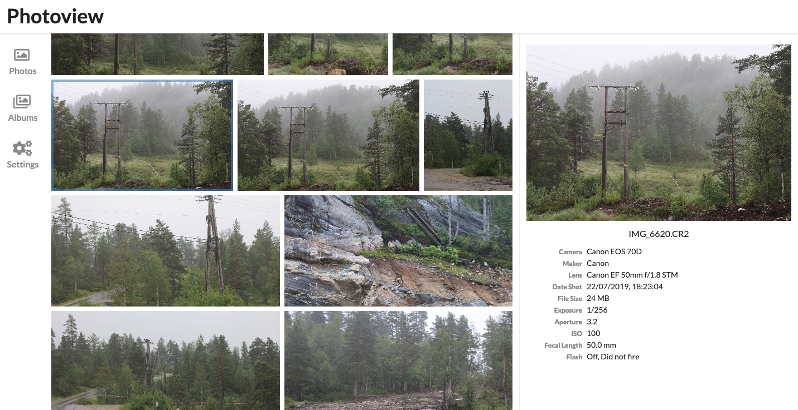

# PhotoView

**SERVER REWRITE. The api is currently being rewritten in Golang, use branch `old-nodejs-server` for the most stable release**



## Demo site

Visit https://photos.qpqp.dk/

Username: **demo**
Password: **demo**

## Aim of the project

The aim of this project is to make a simple and user-friendly photo gallery application,
that is easy to host on a personal server, to easily view the photos located on that server.

## Main features

> The software is still in early development, and many of the following features, may not have been fully implemented yet.

- **Closely tied to the file system**. The website presents the images found on the local filesystem of the server, directories are mapped to albums.
- **User management**. Each user is created along with a path on the local filesystem, photos within that path can be accessed by that user.
- **Photo sharing**. Photos and albums can easily be shared with other users or publicly with a unique URL.
- **Made for photography**. The website is ment as a way to present photographies, and thus supports **RAW** file formats, and **EXIF** parsing.

## Getting started - Setup with Docker

> This section describes how to get PhotoView up and running on your server with Docker.
> Make sure you have Docker and docker-compose installed and running on your server

1. Clone this repository by executing

```bash
$ git clone https://github.com/viktorstrate/photoview
$ cd photoview
```

2. Duplicate `docker-compose.example.yml` and name the new file `docker-compose.yml`
3. Edit `docker-compose.yml`, find the comments starting with `Change This:`, and change the values, to properly match your setup.
4. Start the server by running the following command, inside the `photoview` directory

```bash
$ docker-compose up -d
```

If the endpoint or the port hasn't been changed in the `docker-compose.yml` file, PhotoView can now be accessed at http://localhost:8080

### Initial Setup

If everything is setup correctly, you should be presented with an initial setup wizard, when accessing the website the first time.


Enter a new username and password.

For the photo path, enter the path in the docker container where your photos are located.
This can be set from the `docker-compose.yml` file under `api` -> `volumes`.
The default location is `/photos`

A new admin user will be created, with access to the photos located at the path provided under the initial setup.

The photos will have to be scanned for the photos to show up, you can force a scan, by navigating to `Settings` and clicking on `Scan All`

## Setup development environment

### Local setup

1. Install a local mysql server, and make a new database
2. Rename `/api/example.env` to `.env` and update the `MYSQL_URL` field
3. Rename `/ui/example.env` to `.env`

### [`/api`](./api)

#### Start API server

```bash
cd ./api && go run server/server.go
```

### [`/ui`](./ui)

The above command will start the GraphQL API in the foreground, so in another terminal session start the UI development server:

#### Start UI server

```bash
cd ./ui && npm start
```

The site can now be accessed at [localhost:1234](http://localhost:1234).
And the graphql playground at [localhost:4001](http://localhost:4001)
