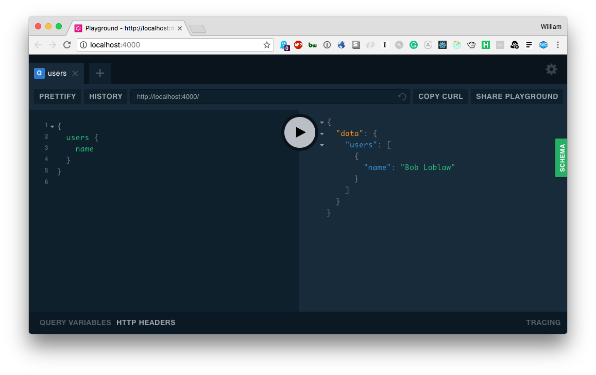
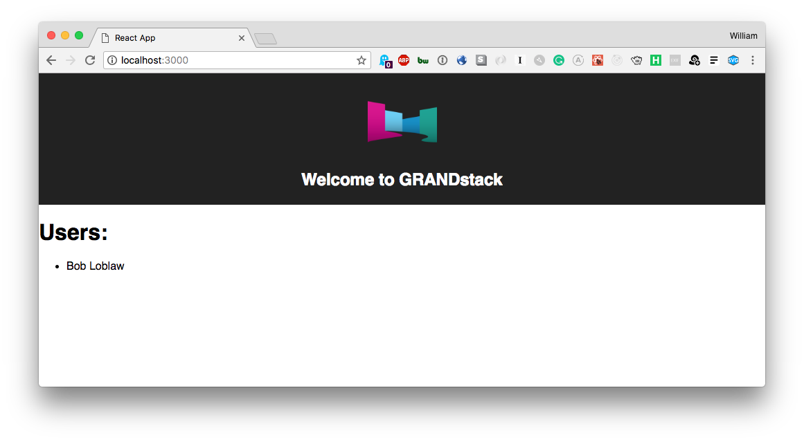

# GRANDstack Starter

This project is a starter for building a [GRANDstack](https://grandstack.io) (GraphQL, React, Apollo, Neo4j Database) application. There are two components to the starter, the UI application (a React app) and the API app (GraphQL server).

## Quickstart

### Neo4j

You need a Neo4j instance, e.g. a [Neo4j Sandbox](http://neo4j.com/sandbox), a local instance via [Neo4j Desktop](https://neo4j.com/download), [Docker](http://hub.docker.com/_/neo4j) or a [Neo4j instance on AWS, Azure or GCP](http://neo4j.com/developer/guide-cloud-deployment) or [Neo4j Cloud](http://neo4j.com/cloud)

For schemas using the  `@cypher` directive via [`neo4j-graphql-js`](https://github.com/neo4j-graphql/neo4j-graphql-js), you need to have the [APOC library](https://github.com/neo4j-contrib/neo4j-apoc-procedures) installed, which is automatic in Sandbox, Cloud and a single click install in Neo4j Desktop. 

### [`/api`](./api)

*Install dependencies*

```
(cd ./ui && npm install)
(cd ./api && npm install)
```

*Start API server*
```
cd ./api && npm start
```



### [`/ui`](./ui)

This will start the GraphQL API in the foreground, so in another terminal session start the UI development server:

*Start UI server*
```
cd ./ui && npm start
```



This project is licensed under the Apache License v2.
Copyright (c) 2018 Neo4j, Inc.
